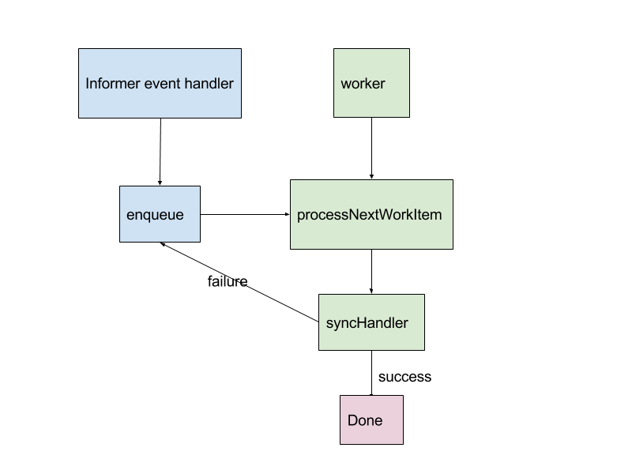

# Handle Transient Failure

Transient failures could happen when operator calls k8s API, Vault API, etc. We need to retry on transient failures.

This is also a common problem for k8s controllers. We also want to learn their workflows, reuse existing tools, and write down a standard process to write resilient code.

Examples:
- [deployment_controller.go](https://github.com/kubernetes/kubernetes/blob/3e8a25e81804051ab47882843795254e268ae7e7/pkg/controller/deployment/deployment_controller.go)
- [deployment_controller_test.go](https://github.com/kubernetes/kubernetes/blob/3e8a25e81804051ab47882843795254e268ae7e7/pkg/controller/deployment/deployment_controller_test.go)
- [client-go workqueue example](https://github.com/kubernetes/client-go/blob/master/examples/workqueue/main.go)

## Workflow

Here is a diagram of abstraction of the workflow:

Notes:

- In syncHandler(), we would try to reconcile all current state to desired state.
- When reconciliation fails, we will backoff and re-queue the item.
- There could be >1 workers in parallel. It’s sharding technique.

## Related Topic: Operator Restart

Operator restart is not transient failure. But when restarted, it basically calls onAdd() to refresh all items.
So what we described in this design also handles operator restart.
